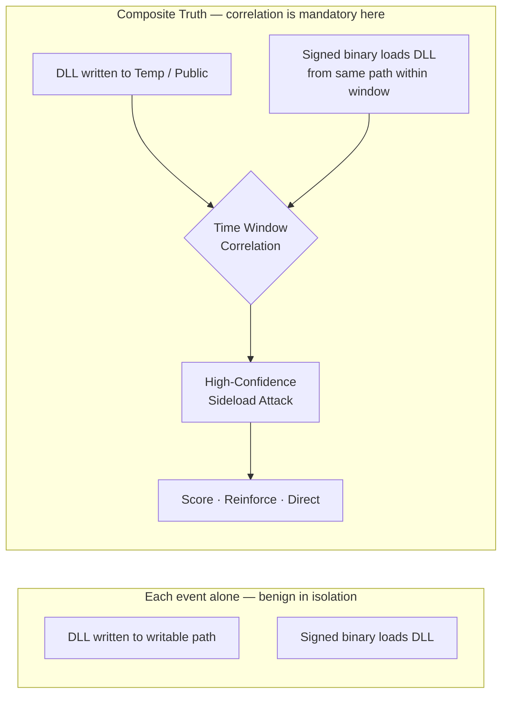
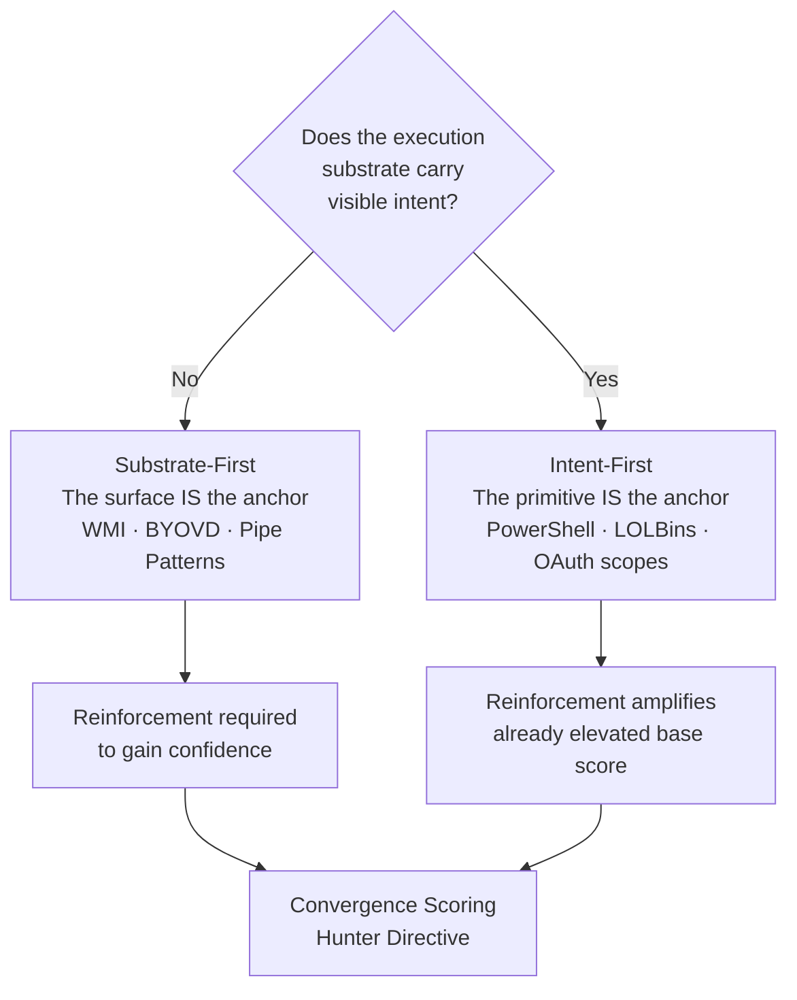
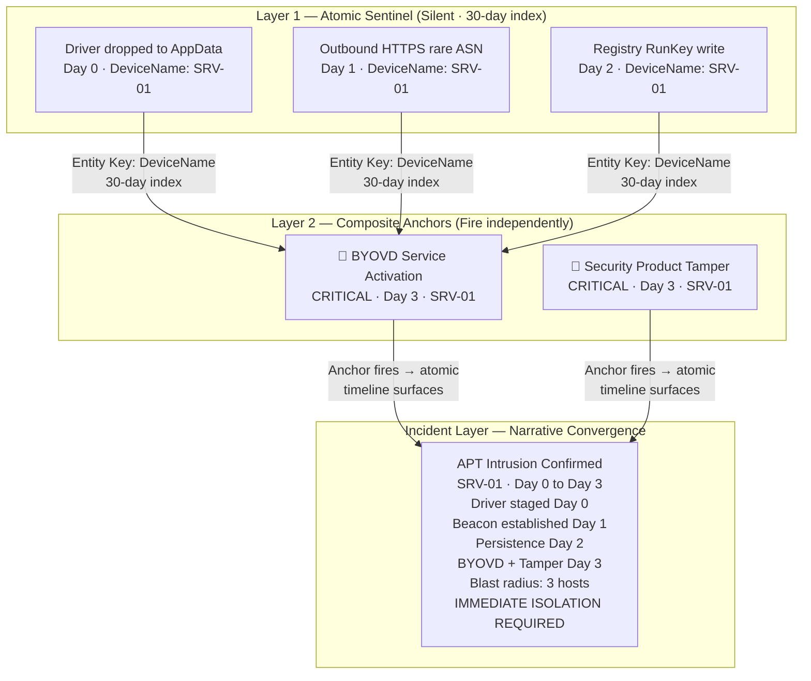
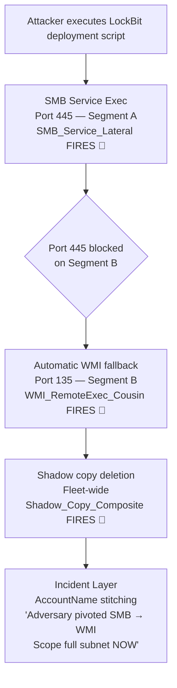
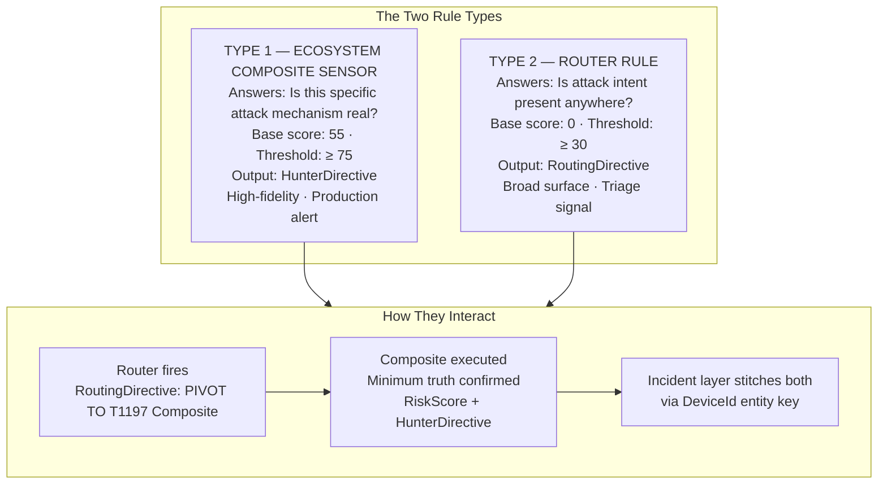
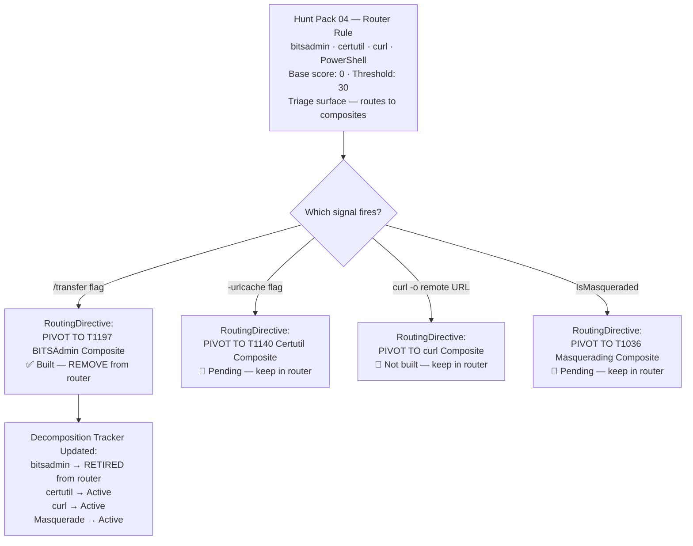
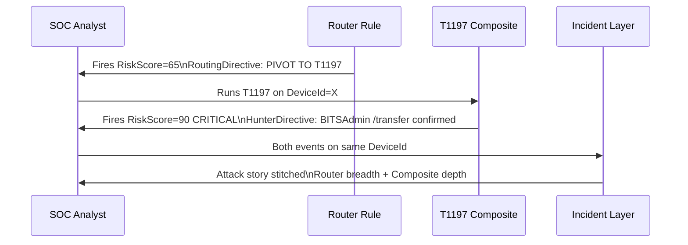

# Minimum Truth Detection Framework
# ATTRIBUTION-NONCOMMERCIAL-SHAREALIKE 4.0 INTERNATIONAL (CC BY-NC-SA 4.0)

Copyright (c) 2026 Ala Dabat. All Rights Reserved.

This work (including all KQL queries, detection logic, documentation, and the "Minimum Truth" Framework architecture) is licensed under the Creative Commons Attribution-NonCommercial-ShareAlike 4.0 International License.

## You are free to:
* **Share** — copy and redistribute the material in any medium or format.
* **Adapt** — remix, transform, and build upon the material.

## Under the following terms:
* **Attribution** — You must give appropriate credit to **Ala Dabat**, provide a link to the license, and indicate if changes were made.
* **NonCommercial** — You may **NOT** use the material for commercial purposes.
* **ShareAlike** — If you remix, transform, or build upon the material, you must distribute your contributions under the same license as the original.

---

> *"Start with the minimum truth required for the attack to exist.*  
> *Everything else is reinforcement — not dependency.*  
> *If the baseline truth is not met, the attack is not real."*

---

```
╔══════════════════════════════════════════════════════════════════════════════╗
║                    MINIMUM TRUTH DETECTION FRAMEWORK                         ║
║                                                                              ║
║    Minimum Truth  ──▶  Reinforcement  ──▶  Scoring  ──▶  Hunter Directive  ║
║                                                                              ║
║    Truth Anchor = Sensor       Reinforcement = Evidence                      ║
║    Cousins = Adjacent Sensors  Incident = Story Stitching                    ║
║                                                                              ║
║    The rule is the sensor. The incident is the narrative.                    ║
╚══════════════════════════════════════════════════════════════════════════════╝
```

---

## Table of Contents

- [Operational Calibration & Testing](#operational-calibration--testing)
- [Engineering Notes](#engineering-notes)
- [Detection Engineering Lifecycle](#detection-engineering-lifecycle)
- [ATT&CK Substrate Adjacency](#attck-substrate-adjacency)
- [Attack Ecosystem Intelligence](#attack-ecosystem-intelligence--defeating-temporal-deception)
- [Why This Repository Exists](#why-this-repository-exists)
- [Detection Maturity Model](#detection-maturity-model)
- [Core Doctrine — The Minimum Truth Funnel](#core-doctrine--the-minimum-truth-funnel)
- [Substrate-First vs Intent-First](#substrate-first-vs-intent-first-minimum-truth)
- [MITRE Ecosystem Coverage — Minimum Truth Anchors & Cousins](#mitre-ecosystem-coverage--minimum-truth-anchors--cousins)
- [OAuth Consent Abuse — Applying Both Anchoring Strategies](#oauth-consent-abuse--applying-both-anchoring-strategies)
- [Noise Model & Suppression Strategy](#noise-model--suppression-strategy)
- [Rarity & Organisational Prevalence](#rarity--organisational-prevalence)
- [Correlation vs Ghost Chains](#correlation-vs-ghost-chains)
- [Primitive Stitching & Incident Narrative Architecture](#primitive-stitching--incident-narrative-architecture)
- [Composite Threat Hunt Portfolio](#composite-threat-hunt-portfolio)
- [Architecture Doctrine — At Scale](#architecture-doctrine--at-scale)
- [Composite Rule Template](#composite-rule-template--registry-persistence-taskcache)
- [Hunter Directives](#hunter-directives)
- [The Rule Factory Checklist](#the-rule-factory-checklist)
- [Architectural Strategy — Split vs Composite](#architectural-strategy--split-vs-composite)
- [Cousin Rules & Attack Ecosystem Coverage](#cousin-rules--attack-ecosystem-coverage)
- [Router Rules — Rules That Sit Outside Ecosystems](#router-rules--rules-that-sit-outside-ecosystems)
- [Production Deployment](#production-deployment)
- [The ATLAS](#the-attack-ecosystem-atlas)

---

## Operational Calibration & Testing

> [!NOTE]
> These detection rules are architected for **logical correctness** and **high-fidelity signal extraction**. Validation was performed in an isolated **ADX-Docker** environment to ensure attack-truth and logic integrity using Empire threat telemetry & Atomic Red Team.
>
> - **Baselines:** Final noise tuning and allow-listing require specific tenant telemetry and administrative context.
> - **Syntax:** Minor syntax variances (e.g., path escaping) may exist due to the difference between Docker-hosted Kusto and live Cloud schemas.

> [!IMPORTANT]
> **Operational Readiness & Integrity**
>
> - **Not "Plug-and-Play":** This is not a copy-paste production repository. Every rule here is considered **untested** unless accompanied by "receipts" — specifically ADX-Docker Empire telemetry results and dedicated documentation.
> - **Engineering vs. Scripting:** This is a record of engineering work, not a basic KQL collection. It represents the iterative process of testing, tuning, and refining logic from scratch.
> - **The Evolution:** While legacy POC repositories contain the "brittle monoliths" of early-career detection, this composite section represents the philosophy of true detection engineering.
> - **Originality:** Nothing in this repository is copied; nothing has been borrowed. This documentation is designed to teach a way of thinking.
> - **The Goal:** Engineering freedom is only found when architecture becomes simple, reductive, and easy to understand.
>
> **This is Detection-As-Code in its purest form.**

---

## Engineering Notes

During validation of the Minimum Truth Detection Framework composite rule set, several recurring implementation pitfalls were identified while stress-testing multiple KQL detections.

These issues do **not affect the detection doctrine itself** (*Minimum Truth → Reinforcement → Scoring → Hunter Directive*), but arise from common **KQL engineering edge cases** including:

- Prevalence window overlap
- Incorrect `leftouter` join handling
- SHA256 rarity edge cases
- Non-deterministic `any()` summarization
- Negative composite score behaviour

**[KQL Detection Engineering — Common Implementation Errors](https://github.com/azdabat/Minimum-Truth-Detection-Framework-ADX-Validated-Composite-Rules/blob/main/KQL%20Detection%20Engineering%20%E2%80%94%20Common%20Implementation%20Errors.md)**

---

## Detection Engineering Lifecycle

> [!IMPORTANT]
> This framework is complemented by a dedicated **Detection Engineering Lifecycle model**, which defines how composite detections are **validated, tuned, scored, and governed in real SOC environments**.
>
> **Read the full lifecycle model here:**
> https://github.com/azdabat/Minimum-Truth-Detection-Framework-ADX-Validated-Composite-Rules/blob/main/Detection_Engineering_Lifecycle.md

---

## ATT&CK Substrate Adjacency

**[ATT&CK Substrate Adjacency — Full Document](https://github.com/azdabat/Minimum-Truth-Detection-Framework-ADX-Validated-Composite-Rules/blob/main/ATT%26CK_Substrate_Adjacency.md)**

MITRE ATT&CK models techniques as independent units with vertical depth (technique → sub-technique). What it does not model is **substrate adjacency** — the reality that many techniques represent the same adversary intent executed across different operating system substrates.

Lateral movement via **SMB (T1021.002)**, **DCOM (T1021.003)**, and **WinRM (T1021.006)** are operationally interchangeable. An adversary pivots dynamically between them based on firewall restrictions, privileges, and endpoint controls. Treating these as independent creates a **false sense of detection coverage**.

The Minimum Truth Detection Framework introduces a **Cousin Technique Doctrine** — modelling adjacent techniques as part of a shared attack ecosystem. This layer sits on top of ATT&CK and enables detection strategies that target **adversary intent** rather than isolated technique identifiers.

---

## Attack Ecosystem Intelligence — Defeating Temporal Deception

Modern adversary tradecraft relies heavily on **Temporal Deception** — staggered C2 jitter, delayed BYOVD kernel exploitation, and automated script loops that pivot dynamically across parallel execution boundaries (Cousin Techniques).

This framework formalises a **hybrid architecture**: deploying optimised, single-surface Behavioural Composites to deliver immediate high-confidence alerts (*Hunter Directives*), while concurrently running a silent Incident-Layer Stitching Engine mapped to common entity keys (`DeviceName`, `AccountName`).

> [!NOTE]
> 👉 **[Attack Ecosystem Intelligence Blueprints](https://github.com/azdabat/Minimum-Truth-Detection-Framework-ADX-Validated-Composite-Rules/blob/main/Attack%20Ecosystem%20Intelligence.md)**

---

## Why This Repository Exists

Most SOCs struggle with threat hunting not because they lack tools, but because:

- Detections are **over-engineered** — monolithic queries that collapse under production load
- Behavioural chains are **forced where they are not required** — ghost chains producing false certainty
- Analysts are overwhelmed by **noise disguised as intelligence**
- Rules are written without regard for **SOC operating reality**

**Focus:** Practical, adversary-informed threat hunting for real SOC environments  
**Audience:** L2 / L2.5 Threat Hunters, Detection Engineers, Security Leads

---

## Detection Maturity Model

### Reductive Baseline — Truth First

Every attack technique has a **minimum condition that must be true**. If that condition is not met, the detection should not exist.

### Composite L2 / L2.5 Hunts

Most attacks do **not** require full behavioural chains. Composite Hunts group related high-signal indicators, prefer single telemetry sources, and use minimal joins only when unavoidable. This is where **most effective threat hunting lives**.

### Reinforcement — Confidence, Not Dependency

Once baseline truth is met, confidence is increased using parent/child execution context, suspicious paths, network proximity, and rarity/prevalence. **Reinforcement never defines the attack.**

### Behavioural Chains — Used Sparingly

Correlation is used **only when the attack cannot exist without multiple linked events**.



---

## Core Doctrine — The Minimum Truth Funnel

### The Problem at Enterprise Scale

In environments of 100,000+ endpoints, traditional detection fails at the database layer.

```
Traditional monolithic rule:
  Stage A  AND  Stage B within 15 minutes  AND  Stage C on same host
  → 100k endpoints → DeviceProcessEvents 500M+ rows/day
  → Cross-table join on raw data → TIMEOUT
  → Attacker delays Stage B by 72 hours → TIME WINDOW MISSED
  → Attacker pivots from SMB to WMI → JOIN CONDITION BROKEN
  → Detection: NULL
```

### The Three Pillars

**Filter Before You Join.** Never join two raw tables. Reduce to the truth first.

**Native Enrichment Over Joins.** `DeviceRegistryEvents` already contains `InitiatingProcessFileName`, `InitiatingProcessSHA256`, `InitiatingProcessSigner`. Use them.

**Contextual Scoring, Not Binary Alerts.** Route surviving data through a convergence matrix.

```
BaseScore (Truth Anchor)      =  55
+ TaskCache Artefact          = +25
+ Dangerous Primitive         = +25
+ Base64 Payload              = +20
+ User-Writable Path          = +15
+ Untrusted Writer            = +10
+ Rare Writer (Prevalence)    = +10
──────────────────────────────────────
FinalScore                    = 160  →  CRITICAL
```

---

## Substrate-First vs Intent-First Minimum Truth

### The Architectural Decision

```
┌─────────────────────────────────────────┬───────────────────────────────────────────┐
│  SUBSTRATE-FIRST                        │  INTENT-FIRST                             │
│  "Did this execution surface exist?"    │  "Did this substrate perform an action    │
│                                         │   that implies attacker capability?"      │
├─────────────────────────────────────────┼───────────────────────────────────────────┤
│  Anchor: execution surface              │  Anchor: malicious primitive              │
│  Use when: no visible intent            │  Use when: substrate is common but        │
│  (WMI fileless, BYOVD, injection)       │  primitive implies capability             │
│  Noise: higher, reinforcement required  │  Noise: lower, base confidence raised     │
└─────────────────────────────────────────┴───────────────────────────────────────────┘
```



### Substrate-First — WMI Fileless Execution

**There is no child process. No command-line argument. No file written to disk.**

```kql
// Minimum Truth — WMI Fileless Execution (T1546.003)
DeviceImageLoadEvents
| where InitiatingProcessFileName =~ "scrcons.exe"
| where FileName in~ ("vbscript.dll", "jscript.dll", "scrobj.dll")
// This is the irreducible minimum. You cannot go further left in the kill chain.
```

### Substrate-First — BYOVD Driver Staging

```kql
// Minimum Truth — BYOVD Driver Staging (T1543.003 / T1068)
DeviceFileEvents
| where FileName endswith ".sys"
| where FolderPath matches regex @"(?i)\\(AppData|Temp|Public|ProgramData|Users)\\"
| where InitiatingProcessSignatureStatus != "Signed"
   or InitiatingProcessFolderPath matches regex @"(?i)\\(AppData|Temp|Public)\\"
```

### Intent-First — The Primitive Implies Capability

```kql
// Minimum Truth — PowerShell Intent (T1059.001)
DeviceProcessEvents
| where FileName in~ ("powershell.exe", "pwsh.exe")
| where ProcessCommandLine has_any (
    "Invoke-WebRequest", "DownloadString",
    "FromBase64String", "IEX",
    "Add-Type", "-EncodedCommand",
    "VirtualAlloc", "OpenProcess"
)
```

> **Substrate first. Reinforcement second. Always.**

---

## MITRE Ecosystem Coverage — Minimum Truth Anchors & Cousins

```mermaid
graph LR
    subgraph MITRE_Ecosystems["Core MITRE Attack Ecosystems"]
        P[Persistence\nT1053 · T1547 · T1543 · T1546]
        LM[Lateral Movement\nT1021 · T1570]
        CA[Credential Access\nT1003 · T1558 · T1621]
        EX[Execution\nT1059 · T1218 · T1546]
        DE[Defense Evasion\nT1562 · T1055 · T1036]
        C2[Command & Control\nT1071 · T1095]
        EF[Exfiltration\nT1041 · T1567 · T1048]
    end
    subgraph Framework["Framework Response"]
        CS[Cousin Sensors\nCovering adjacent substrates]
        MT[Minimum Truth Anchors\nSubstrate-First or Intent-First]
        IL[Incident Layer\nNarrative stitching]
    end
    MITRE_Ecosystems --> MT --> CS --> IL
```



### Persistence Ecosystem

| Technique | Minimum Truth Anchor | Anchoring Strategy | MITRE | Cousin Techniques | Cousin MITRE |
|-----------|---------------------|--------------------|-------|-------------------|--------------|
| Silent TaskCache Persistence | `RegistryValueSet` under `Schedule\TaskCache` | Substrate-First | T1053.005 | CLI `schtasks.exe /create` | T1053.005 |
| Registry Run Key Persistence | `RegistryValueSet` under `\Run` or `\RunOnce` | Intent-First | T1547.001 | ActiveSetup · AppInit · Winlogon | T1547.014 · T1546.010 |
| Service Persistence (ImagePath) | `RegistryValueSet` on `ImagePath` in `Services` | Intent-First | T1543.003 | BYOVD Driver Service | T1543.003 · T1068 |
| WMI Permanent Subscription | `scrcons.exe` loads script engine DLL | Substrate-First | T1546.003 | COM Hijacking · IFEO | T1546.015 · T1546.012 |

### Lateral Movement Ecosystem

| Technique | Minimum Truth Anchor | Anchoring Strategy | MITRE | Cousin Techniques | Cousin MITRE |
|-----------|---------------------|--------------------|-------|-------------------|--------------|
| SMB Service Execution | `services.exe` spawning uncommon child binary | Intent-First | T1021.002 | WMI Remote Exec · WinRM · DCOM | T1021.003 · T1021.006 |
| WMI Remote Execution | `WmiPrvSE.exe` spawning cmd/powershell | Substrate-First | T1021.003 | PsExec · AT Scheduler · WMIC | T1021.002 · T1053.005 |
| Pass-the-Hash | Network logon type 3 without interactive logon | Substrate-First | T1550.002 | Pass-the-Ticket · Overpass-the-Hash | T1550.003 |

### Credential Access Ecosystem

| Technique | Minimum Truth Anchor | Anchoring Strategy | MITRE | Cousin Techniques | Cousin MITRE |
|-----------|---------------------|--------------------|-------|-------------------|--------------|
| LSASS Memory Dump | Non-AV process opens LSASS with ReadProcessMemory rights | Substrate-First | T1003.001 | DCSync Replication · SAM Extract | T1003.006 · T1003.002 |
| DCSync | Non-DC account performs `GetChanges` replication rights request | Substrate-First | T1003.006 | NTDS.dit Volume Shadow Copy extract | T1003.003 |
| Kerberoasting | Unusual volume of TGS requests using RC4 from non-admin | Intent-First | T1558.003 | AS-REP Roasting (no preauth) | T1558.004 |

### Execution Ecosystem

| Technique | Minimum Truth Anchor | Anchoring Strategy | MITRE | Cousin Techniques | Cousin MITRE |
|-----------|---------------------|--------------------|-------|-------------------|--------------|
| PowerShell Abuse | `-enc` / `IEX` / `VirtualAlloc` primitives | Intent-First | T1059.001 | WScript · CScript · mshta execution | T1059.005 · T1218.005 |
| mshta.exe Proxy Exec | `mshta.exe` with `http://` or `vbscript:` argument | Intent-First | T1218.005 | regsvr32 Squiblydoo · rundll32 | T1218.010 · T1218.011 |
| certutil.exe Decode | `certutil.exe -decode` or `-urlcache` invocation | Intent-First | T1140 | bitsadmin · curl · PowerShell WebRequest | T1197 · T1059.001 |
| DLL Sideloading | Signed binary loads DLL from user-writable path | Substrate-First (correlation required) | T1574.002 | DLL Search Order Hijack · Phantom DLL | T1574.001 |

### Defense Evasion Ecosystem

| Technique | Minimum Truth Anchor | Anchoring Strategy | MITRE | Cousin Techniques | Cousin MITRE |
|-----------|---------------------|--------------------|-------|-------------------|--------------|
| Security Product Tamper | `fltmc.exe unload` or `WinDefend` stop primitives | Intent-First | T1562.001 | Exclusion path addition (`Add-MpPreference`) | T1562.001 |
| BYOVD Rootkit Activation | Service created pointing to `.sys` in writable path | Substrate-First | T1068 · T1543.003 | Kernel Callback Modification | T1014 |
| Process Injection | `VirtualAlloc` in PowerShell script block or via LOLBin | Substrate-First | T1055 | Process Hollowing · Thread Hijack | T1055.012 · T1055.003 |

### Command & Control Ecosystem

| Technique | Minimum Truth Anchor | Anchoring Strategy | MITRE | Cousin Techniques | Cousin MITRE |
|-----------|---------------------|--------------------|-------|-------------------|--------------|
| Named Pipe C2 | Pipe creation matching known implant naming pattern | Substrate-First | T1071 | HTTP/S Beaconing to rare ASN | T1071.001 |
| Encrypted C2 (HTTPS Jitter) | Low-volume outbound HTTPS to first-seen domain by LOLBin | Intent-First | T1071.001 | DNS Tunnelling · ICMP C2 | T1071.004 · T1095 |

### Exfiltration Ecosystem

| Technique | Minimum Truth Anchor | Anchoring Strategy | MITRE | Cousin Techniques | Cousin MITRE |
|-----------|---------------------|--------------------|-------|-------------------|--------------|
| LOLBin Exfiltration | `bitsadmin /transfer` or `certutil -urlcache` to external | Intent-First | T1197 · T1041 | PowerShell `Invoke-WebRequest` POST | T1059.001 |
| Cloud Storage Exfil | Bulk OneDrive/SharePoint download spike vs user baseline | Substrate-First (deviation) | T1567.002 | Archive staging before exfil (`7z`/`rar`) | T1560.001 |

---

## OAuth Consent Abuse — Applying Both Anchoring Strategies

### OAuth Substrate-First

```kql
AuditLogs
| where OperationName in~ (
    "Consent to application",
    "Add delegated permission grant",
    "Add app role assignment grant to service principal"
)
| where Result =~ "success"
```

### OAuth Intent-First

```kql
AuditLogs
| where OperationName in~ (
    "Consent to application",
    "Add delegated permission grant",
    "Add app role assignment grant to service principal"
)
| where Result =~ "success"
| mv-expand TargetResources[0].modifiedProperties
| where tostring(TargetResources[0].modifiedProperties.newValue) has_any (
    "Mail.ReadWrite", "Directory.ReadWrite.All",
    "AppRoleAssignment.ReadWrite.All",
    "RoleManagement.ReadWrite.Directory",
    "Files.ReadWrite.All", "Sites.FullControl.All"
)
```

---

## Noise Model & Suppression Strategy

### Core Principle

Noise is not removed through blind exclusions. It is **measured, profiled, and down-scored**.

```kql
// ❌ Hard exclusion — creates structural blind spots
| where InitiatingProcessFileName != "ccmexec.exe"

// ✅ Soft-allow scoring model
let Penalty_ManagedLineage = -25;
let Penalty_InternalNet    = -10;
let Penalty_HighBurst      = -20;
```

```kql
let Score_EncodedPrimitive = 40;
let Score_SuspiciousParent = 30;
let Score_WritablePath     = 20;
let Score_ExternalNetwork  = 25;
let Score_RareExecution    = 15;

let Penalty_ManagedLineage = -25;
let Penalty_InternalNet    = -10;
let Penalty_HighBurst      = -20;
```

| Principle | Implementation |
|-----------|----------------|
| No brittle allowlists | Score reduction instead of exclusion |
| Measure before suppressing | Empirical baseline extraction first |
| Convergence required | Multiple reinforcement layers needed for escalation |
| Prevalence modifies urgency | Never suppresses alerts |
| Burst modelling | Differentiates mass automation from targeted intrusion |

> **Noise suppression must never create blind spots.**

---

## Rarity & Organisational Prevalence

> **Rarity is not a detection trigger. It is a prioritisation and confidence amplifier.**

- 1–2 hosts → likely targeted intrusion → escalate
- 200+ hosts → likely IT automation → deprioritise (never suppress)

> **Rarity decides how fast we respond — not whether we respond.**

---

## Correlation vs Ghost Chains

> **Correlation is only valid when the attack cannot exist without multiple linked events.**

```kql
// ❌ Ghost chain — forces false narrative
RegistryValueSet
| join NetworkConnection on DeviceId
| join ProcessInjection on DeviceId
| where all within 10 minutes

// ✅ Independent sensors — correct architecture
DeviceRegistryEvents
| where RegistryKey has "\\Run"
| where RegistryValueData has "powershell"
// Truth: persistence exists. Alert on this alone.
```

> **Correlation is not sophistication. Correlation is dependency.**

---

## Primitive Stitching & Incident Narrative Architecture

### The Two-Layer Fusion Architecture

```
┌──────────────────────────────────┬────────────────────────────────────────────┐
│  LAYER 1: ATOMIC SENTINEL        │  LAYER 2: BEHAVIOURAL COMPOSITE            │
│  (The Net)                       │  (The Anchor)                              │
├──────────────────────────────────┼────────────────────────────────────────────┤
│  Continuous silent logging       │  High-fidelity minimum truth detection     │
│  No individual alert threshold   │  Fires as Instant Hit Anchor               │
│  30-day rolling entity index     │  Immediate HunterDirective output          │
│  Catches what composites miss    │  Triggers pivot into atomic timeline       │
│  Defeats temporal deception      │  Localized time window (2h–48h)            │
└──────────────────────────────────┴────────────────────────────────────────────┘
```



### Entity Keys

| Entity Key | Stitching Context |
|------------|------------------|
| `DeviceName` | Host-level — connects all events to one machine |
| `AccountName` | Identity-level — connects to same actor across hosts |
| `DeviceId` | Hardware-level — tamper-resistant stitching |
| `SHA256` | Artefact-level — connects binary drops across time |
| `RemoteIP / ASN` | Infrastructure-level — C2 attribution across hosts |

---

## Composite Threat Hunt Portfolio

**Live MITRE Coverage Matrix:** https://azdabat.github.io/Minimum-Truth-Detection-Framework-ADX-Validated-Composite-Rules/MITRE-MATRIX.html

### Tier-1 Baseline Pack

| Ecosystem | Composite Built | Reinforcement Tuned | Atomic Validated | Maturity |
|-----------|-----------------|---------------------|------------------|----------|
| **PowerShell Execution & Abuse** | ✅ Yes | ⚠️ Partial | ⚠️ In Progress | MED |
| **Registry Autoruns (Run/RunOnce)** | ✅ Yes | ✅ Strong | ✅ Tested | HIGH |
| **Scheduled Tasks (CLI Creation)** | ✅ Yes | ✅ Strong | ✅ Tested | HIGH |
| **Scheduled Tasks (Silent TaskCache)** | ✅ Yes | ⚠️ Needs Noise Calibration | ⚠️ In Progress | MED |
| **Service Persistence (ImagePath)** | ⚠️ Partial | ❌ Not Tuned | ❌ Not Yet | LOW |
| **Credential Access (LSASS Surface)** | ✅ Yes | ⚠️ Partial | ⚠️ In Progress | MED |
| **NTDS / SAM Extraction** | ✅ Yes | ⚠️ Partial | ❌ Not Yet | MED |
| **LOLBins Proxy Execution Core** | ✅ Yes | ⚠️ Needs Baselines | ❌ Not Yet | MED |
| **Cloud Identity Persistence (OAuth Consent)** | ✅ Yes | ✅ Strong | ⚠️ Tenant Validation Needed | HIGH |

### Tier-2 Composite Correlation Pack

| Ecosystem | Minimum Truth Anchor | Status | Maturity |
|-----------|----------------------|--------|----------|
| **Registry Hijacks (IFEO/COM/AppInit)** | Execution interception registry truth | ⚠️ Partial | MED |
| **WMI Persistence + Execution** | Subscription + anomalous consumer truth | ✅ Built | HIGH |
| **Lateral Movement (SMB Service / PsExec)** | Remote service creation truth | ⚠️ Partial | MED |
| **Defense Evasion (Signed LOLBin Chains)** | Trusted parent → LOLBin baseline | ⚠️ POC → Composite | MED |
| **Session / Token Misuse (Post-Consent)** | Token replay baseline truth | ✅ Built | HIGH |
| **Ingress Tool Transfer** | Writable staging drop truth | ⚠️ In Progress | MED |
| **Shadow Copy Destruction (Ransomware Prep)** | vssadmin/wmic delete truth | ❌ Missing | LOW |
| **Archive Staging + Exfil Prep** | 7z/rar bulk staging truth | ❌ Missing | LOW |

### Tier-3 Research & Novel Threat Ecosystems

| Threat Ecosystem | Status | Notes |
|-----------------|--------|-------|
| **React2Shell / IIS Exploit Chains** | ✅ Modelled | Requires telemetry hardening |
| **EtherRAT / Blockchain C2** | ✅ Documented | Network correlation expansion needed |
| **SilverFox / ValleyRAT BYOVD** | ⚠️ Advanced Composite | Needs DriverLoadEvent validation |
| **Pulsar RAT Injection + Tasks** | 🟡 Parked POC | Awaiting confirmed ecosystem truth |
| **Kernel Driver Abuse (BYOVD)** | ⚠️ Partial | High impact, tuning required |
| **Supply Chain Behaviour Modelling** | ✅ Threat Modelled | Tier-2 rule ownership pending |

---

## Architecture Doctrine — At Scale

**Filter Before You Join.** Reduce the primary table to minimum truth before any context enrichment.

**Zero-Join Native Enrichment.** `InitiatingProcess*` fields eliminate raw table joins entirely.

**Pre-Summarised Safe Join.** Summarise prevalence tables first. Small table joined to small table.

**Convergence Scoring.** Output with SOC-ready Hunter Directive. Not a binary alert. A contextual story.

---

## Composite Rule Template — Registry Persistence TaskCache

```kusto
// ============================================================================
// COMPOSITE HUNT (L3): Registry_Persistence_Background_Service_TaskCache
// Author: Ala Dabat
// Platform: Microsoft Defender XDR / Sentinel Advanced Hunting
// Minimum Truth: RegistryValueSet under Services OR Schedule TaskCache
// MITRE: T1543.003, T1053.005
// ============================================================================

let lookback = 14d;

let TrustedPublishers  = dynamic(["Microsoft Corporation","Microsoft Windows","Google LLC","Mozilla Corporation"]);
let TrustedInitiators  = dynamic(["msiexec.exe","trustedinstaller.exe","sppsvc.exe","intunemanagementextension.exe","updateinstaller.exe"]);
let BackgroundKeys     = dynamic([
    @"system\currentcontrolset\services",
    @"software\microsoft\windows nt\currentversion\schedule\taskcache\tree",
    @"software\microsoft\windows nt\currentversion\schedule\taskcache\tasks"
]);
let UserWritableRx     = @"(?i)^[a-z]:\\(users|public|programdata|temp|downloads|appdata)\\";
let Base64ChunkedRx    = @"(?:[A-Za-z0-9+/]{20,}={0,2})(?:\s+[A-Za-z0-9+/]{20,}={0,2})+";
let DangerTokens       = dynamic([
    "powershell","pwsh","cmd.exe","mshta","rundll32","regsvr32","wscript","cscript",
    "certutil","bitsadmin","curl","-enc","-encodedcommand","frombase64string","http:","https:"
]);
let SafePathAnchors    = dynamic([@"c:\program files",@"c:\program files (x86)",@"c:\windows\system32",@"c:\windows\syswow64"]);
let SafeVendorKeywords = dynamic(["windows update","microsoft","google","edge","mozilla","firefox","onedrive","teams","intel","nvidia","amd","realtek","adobe","citrix"]);
let PayloadSizeThreshold = 500;

let OrgPrevalence =
    DeviceFileEvents
    | where Timestamp >= ago(30d)
    | summarize WriterDeviceCount = dcount(DeviceId) by SHA256;

let Raw =
    DeviceRegistryEvents
    | where Timestamp >= ago(lookback)
    | where ActionType == "RegistryValueSet"
    | extend RK  = tolower(tostring(RegistryKey)),
             RVN = tolower(tostring(RegistryValueName)),
             RVD = tolower(tostring(RegistryValueData))
    | where RK has_any (BackgroundKeys);

let Enriched =
    Raw
    | extend
        WriterFile    = tostring(InitiatingProcessFileName),
        WriterCL      = tostring(InitiatingProcessCommandLine),
        WriterSHA     = tostring(InitiatingProcessSHA256),
        WriterSigner  = tostring(InitiatingProcessSigner),
        WriterCompany = tostring(InitiatingProcessVersionInfoCompanyName),
        WriterUser    = tostring(InitiatingProcessAccountName)
    | extend
        WriterFileL            = tolower(coalesce(WriterFile,"")),
        WriterCLL              = tolower(coalesce(WriterCL,"")),
        WriterTrustedPublisher = toint(WriterCompany in (TrustedPublishers) or WriterSigner in (TrustedPublishers)),
        WriterTrustedInitiator = toint(WriterFileL in (TrustedInitiators))
    | join kind=leftouter OrgPrevalence on $left.WriterSHA == $right.SHA256
    | extend
        WriterDeviceCount = coalesce(WriterDeviceCount, 0),
        WriterIsRare      = toint(WriterDeviceCount <= 2);

Enriched
| extend
    IsService             = toint(RK has "system\\currentcontrolset\\services"),
    IsTaskCache           = toint(RK has "schedule\\taskcache"),
    ServiceImagePathWrite = toint(IsService==1 and (RVN == "imagepath" or RVN has "imagepath")),
    HasDanger             = toint(RVD has_any (DangerTokens) or WriterCLL has_any (DangerTokens)),
    HasBase64             = toint(RVD matches regex Base64ChunkedRx or WriterCLL matches regex Base64ChunkedRx),
    PointsWritable        = toint(RVD matches regex UserWritableRx),
    IsLargeBlob           = toint(strlen(RVD) > PayloadSizeThreshold),
    IsSafePath            = toint(RVD has_any (SafePathAnchors)),
    IsSafeVendor          = toint(RVD has_any (SafeVendorKeywords) or RVN has_any (SafeVendorKeywords)),
    UntrustedWriter       = toint(WriterTrustedPublisher == 0)
| where (IsService==1 or IsTaskCache==1)
| where (IsTaskCache==1) or (ServiceImagePathWrite==1) or (HasDanger==1) or (PointsWritable==1) or (IsLargeBlob==1)
| where not(IsSafePath==1 and IsSafeVendor==1 and HasDanger==0 and HasBase64==0 and PointsWritable==0 and IsLargeBlob==0)
| where not(WriterTrustedInitiator==1 and (HasDanger + HasBase64 + PointsWritable + IsLargeBlob) == 0)
| extend
    RiskScore = 55
              + (25 * IsTaskCache)
              + (20 * ServiceImagePathWrite)
              + (25 * HasDanger)
              + (20 * HasBase64)
              + (15 * PointsWritable)
              + (25 * IsLargeBlob)
              + (10 * UntrustedWriter)
              + (10 * WriterIsRare),
    RiskLevel = case(RiskScore >= 120, "CRITICAL",
                     RiskScore >= 90,  "HIGH",
                     RiskScore >= 70,  "MEDIUM", "LOW")
| where RiskLevel in ("MEDIUM","HIGH","CRITICAL")
| extend DecodedPayload = iif(isnotempty(extract(@"([A-Za-z0-9+/]{40,})", 1, RegistryValueData)),
    base64_decode_string(tostring(extract(@"([A-Za-z0-9+/]{40,})", 1, RegistryValueData))), "")
| extend HunterDirective = case(
    RiskLevel=="CRITICAL" and IsTaskCache==1,
        "CRITICAL: Silent Scheduled Task persistence via TaskCache (API/COM). Pull task definition, isolate if unauthorised.",
    RiskLevel=="CRITICAL" and ServiceImagePathWrite==1,
        "CRITICAL: Service persistence set (ImagePath) with strong indicators. Validate service name + binary path.",
    RiskLevel=="HIGH",
        "HIGH: Background persistence registry artefact. Pivot to writer ancestry.",
        "MEDIUM: Background persistence signal. Validate if approved updater/agent; if not, escalate."
)
| project
    Timestamp, DeviceName, DecodedPayload,
    AccountName = coalesce(WriterUser, tostring(AccountName)),
    RegistryKey, RegistryValueName, RegistryValueData,
    WriterProcess = WriterFile, WriterCommandLine = WriterCL,
    WriterCompany, WriterSigner, WriterSHA, WriterDeviceCount,
    RiskScore, RiskLevel, HunterDirective
| order by RiskScore desc, Timestamp desc
```

---

## Hunter Directives

Every composite hunt produces **guidance alongside results — not after**.

Each rule outputs a `HunterDirective` that answers:
1. **Why** this fired — baseline truth confirmed
2. **What** reinforces confidence — scoring context
3. **What** to do next — pivot, scope blast radius, escalate

> *HIGH: LSASS accessed by non-AV process using dump-related command line.*  
> *Action: Validate tool legitimacy, scope for lateral movement, escalate to L3.*

---

## The Rule Factory Checklist

| Requirement | Check |
|-------------|-------|
| Minimum Truth is 1 clear anchor | ✅ |
| Reinforcement signals are optional (2–4 max) | ✅ |
| Noise suppression is explicit | ✅ |
| Org prevalence is scoring only — never a hard filter | ✅ |
| Severity is cumulative, not binary | ✅ |
| Output is SOC-actionable with Hunter Directive | ✅ |

> **The Golden Rule: If you cannot explain the hunt in 60 seconds, it is too complex.**

---

## Architectural Strategy — Split vs Composite

> We group rules by **Attack Surface Ecosystem** — not by MITRE Tactic.

| Shift | Decision |
|-------|----------|
| Host process execution → Identity log transaction | ✂️ SPLIT |
| SMB lateral movement → WMI lateral movement | ✂️ SPLIT |
| Endpoint execution → Identity sign-in truth | ✂️ SPLIT |
| Same LOLBin surface, different intent primitives | ✅ KEEP |

| Ecosystem | Scenario | Decision | Reason |
|-----------|----------|----------|--------|
| **Scheduled Tasks** | `schtasks.exe /create` vs `Register-ScheduledTask` | ✂️ SPLIT | Different truth surface: CLI vs API |
| **Lateral Movement** | SMB service exec vs WMI remote process | ✂️ SPLIT | Different mechanism, different noise domain |
| **Credential Access** | LSASS dump vs DCSync vs Kerberoasting | ✂️ SPLIT | Different telemetry surfaces entirely |
| **LOLBin Execution** | rundll32 vs regsvr32 vs mshta (same parent, same intent) | ✅ KEEP | Same process surface, same attacker goal |

---

## Cousin Rules & Attack Ecosystem Coverage

> Cousin rules are **separate but paired** — they do not mix truth anchors with noisy signals.



**The pivot is not a defence. It is a data point.**

| Ecosystem | Primary Composite | MITRE | Cousin Composite | Cousin MITRE |
|-----------|------------------|-------|-----------------|--------------|
| **Registry Persistence** | `Registry_Persistence_Background_Service_TaskCache` | T1543.003, T1053.005 | Registry Persistence Alternate Anchors | T1543, T1053 |
| **Scheduled Tasks** | TaskCache + Registry | T1053.005 | `ScheduledTask_Execution_TwinRule` | T1053.005 |
| **Lateral Movement** | `SMB_Service_Lateral` | T1021.002 | `WMI_RemoteExec_Cousin` | T1021.003 |
| | | | `WinRM_Exec_Cousin` | T1021.006 |
| **Execution (LOLBins)** | `TrustedParent_LOLBin_InMemoryInjection_Chain` | T1218 / T1055 | `TaskExec_LOLBin_Injection_Cousin` | T1218/T1055 |
| **Credential Access** | LSASS composite | T1003.001 | `LSASS_Access_Cousin` | T1003.006 |
| **Identity Abuse** | OAuth consent composite | T1621 / T1078.004 | `Identity_ConsentGrant_Cousin` | T1621 |
| **Persistence (Driver)** | BYOVD POC/Research | T1547 / T1543 | `Driver_Persistence_Cousin` | T1543.008 |

**Live Roadmap:** https://azdabat.github.io/Minimum-Truth-Detection-Framework-ADX-Validated-Composite-Rules/MITRE-MATRIX.html

---

## Router Rules — Rules That Sit Outside Ecosystems

Not every composite belongs inside a single attack ecosystem. In production, a second class of rules exists alongside composite sensors:

> **Router Rules — Surface Aggregators**  
> Wide, low-cost detectors that identify attack intent across multiple surfaces, then route the analyst into the correct ecosystem composite for confirmation.



### When Router Rules Are Valid

A router rule is **valid** when ALL of the following are true:

1. Multiple techniques are in scope AND they have **different noise domains**
2. Output explicitly **routes to ecosystem composites** — a RoutingDirective, not a HunterDirective
3. Base score is **0** — signals build from zero, not from 55
4. No technique in the rule has a **validated composite** yet (if it does, the composite takes over)
5. A **decomposition tracker** is present — documents which composites retire each technique

A router rule is **NOT valid** when:

| Condition | Reason |
|-----------|--------|
| Validated composite exists for the technique | The composite takes over — retire the technique from the router |
| Techniques share the same noise domain | Combine in a composite pack instead |
| High-confidence SOC alert required | Composite sensors only — routers cannot produce reliable high-confidence alerts |
| Used permanently instead of building composites | Router rules are coverage debt, not architecture |

### The Canonical Example — Ingress Tool Transfer

The ingress tool transfer router rule (Hunt Pack 04) is the clearest example of a valid router rule in the MTDF ecosystem:



**Why these tools cannot be combined in a composite:**

| Tool | Enterprise Noise Profile | Suppression Logic Needed |
|------|-------------------------|-----------------------------|
| bitsadmin.exe | SCCM, Windows Update, Intune | Managed endpoint lineage penalty |
| certutil.exe | Developer certificate tooling, PKI ops | Dev machine + IT baseline penalty |
| curl.exe | DevOps pipelines, Linux tooling | CI/CD runner context penalty |
| powershell.exe | Everything | Extensive intent filtering required |

These four tools require four completely different suppression models. Combining them into one composite produces a rule that cannot be tuned for one tool without creating blind spots for another.

### The Scoring Architecture Difference

```kql
// ── ROUTER RULE — Base starts at ZERO ───────────────────────
// No minimum truth is established in a router rule.
// Signals build the case incrementally from nothing.
// The analyst acts when enough signals converge — triage, not alert.

| extend RawScore = 0
    + iff(IsMasqueraded == 1,        50, 0)  // Renamed binary — strong
    + iff(HasRemoteURL == 1,         20, 0)  // External download
    + iff(IsShellParent == 1,        15, 0)  // Shell parent
    + iff(IsDangerousExtension == 1, 10, 0)  // Executable drop
| extend RiskScore = iif(RawScore < 0, 0, RawScore)
| where RiskScore >= 30  // LOW THRESHOLD — triage surface

// ── COMPOSITE SENSOR — Base starts at 55 ────────────────────
// Minimum truth already established in Phase 1.
// Reinforcement amplifies an already elevated signal.

| extend RawScore = 55   // Base: /transfer + remote URL = structural truth
    + iff(IsHighRiskDomain == 1,   15, 0)
    + iff(IsUserWritableDrop == 1, 10, 0)
    + iff(IsShellParent == 1,      10, 0)
| extend RiskScore = iif(RawScore < 0, 0, RawScore)
| where RiskScore >= 75  // HIGH THRESHOLD — production alert
```

### Router Rule Template

```kql
// ============================================================================
// ROUTER RULE: [Technique Family Name]
// Architecture: Router Rule — Triage Surface
// Scope: [list techniques covered]
// Base score: 0 — signals build from zero
// Threshold: 30 — lower than composite (triage, not production alert)
// TEMPORARY: Retire each technique when dedicated composite ADX validated
//
// DECOMPOSITION STATUS:
// ┌──────────────────┬──────────────────────────────┬────────────────────┐
// │ Technique        │ Composite Status             │ Action             │
// ├──────────────────┼──────────────────────────────┼────────────────────┤
// │ [technique 1]    │ [Composite name — built/pend]│ [Remove/Keep]      │
// │ [technique 2]    │ [Not built]                  │ [Keep in router]   │
// └──────────────────┴──────────────────────────────┴────────────────────┘
// ============================================================================

let lookback = 7d;

// ── PHASE 1: BROAD SURFACE FILTER ──────────────────────────────────────────
[broad filter across technique family]

// ── PHASE 2: SIGNAL ENRICHMENT ─────────────────────────────────────────────
| extend IsMasqueraded = toint(
    isnotempty(tolower(tostring(
        column_ifexists("ProcessVersionInfoOriginalFileName", ""))))
    and tolower(FileName) != tolower(tostring(
        column_ifexists("ProcessVersionInfoOriginalFileName", "")))
)

// ── PHASE 3: ROUTING SCORE ─────────────────────────────────────────────────
// Base = 0 for router rules — non-negotiable
| extend RawScore = 0
    + iff(IsMasqueraded == 1, 50, 0)
| extend RiskScore = iif(RawScore < 0, 0, RawScore)
| where RiskScore >= 30

// ── PHASE 4: ROUTING DIRECTIVE ─────────────────────────────────────────────
| extend RoutingDirective = case(
    IsMasqueraded == 1,
        "→ PIVOT TO: T1036 Masquerading Composite",
    ProcessCommandLine has "/transfer",
        "→ PIVOT TO: T1197 BITSAdmin Transfer Composite",
    ProcessCommandLine has "-urlcache",
        "→ PIVOT TO: T1140 Certutil Composite — pending build",
    "→ INVESTIGATE: No composite yet — engineer one"
)
| summarize arg_max(Timestamp, *) by DeviceId, AccountName
| project Timestamp, DeviceName, AccountName, FileName,
          ProcessCommandLine, RiskScore, IsMasqueraded, RoutingDirective
| sort by RiskScore desc
```

### Router + Composite Interaction Model



> **Router rules detect intent.**  
> **Ecosystem composites confirm truth.**  
> **This prevents monoliths while maintaining full surface coverage.**  
> **A router rule that is never retired is coverage debt, not architecture.**

---

## Production Deployment

Each Composite Rule is deployed as an always-on detection sensor:

- **Truth Anchor** defines the technique
- **Reinforcement** increases confidence — never dependency
- **Cousin Rules** provide adjacent surface parity
- **Router Rules** provide breadth coverage until composites are built
- **Attack Ecosystem chaining** creates incidents without monolithic kill-chain queries

### Repository Architecture

| Repository | Role in Framework |
|------------|-------------------|
| `Minimum-Truth-Detection-Framework-ADX-Validated-Composite-Rules` | Tier-1/Tier-2 deployable composites — ADX validated |
| `Production-READY-Composite-Threat-Hunting-Rules` | Production-hardened rules with receipts |
| `Attack-Ecosystems-and-POC` | Tier-3 novel threats + emerging tradecraft |
| `THREAT-MODELLING-SOP-Behavioural-Patch-Resistant-TTPs` | Architectural doctrine + design SOPs |
| `ATLAS-ATTACK-ECOSYSTEM` | Strategic ecosystem map — cousin relationships, coverage gaps |

---

## The Attack Ecosystem ATLAS

**[Enter The ATLAS — The Strategic Map of Attack Ecosystems](https://github.com/azdabat/ATLAS-ATTACK-ECOSSYSTEM)**

**[→ OPEN INTERACTIVE ROADMAP](https://azdabat.github.io/Minimum-Truth-Detection-Framework-ADX-Validated-Composite-Rules/MTDF-Composite-Roadmap.html)**

---

```
╔══════════════════════════════════════════════════════════════════════════════╗
║                         FINAL PRINCIPLE                                     ║
║                                                                              ║
║  Substrate answers:      Did the execution surface exist?                   ║
║  Intent answers:         Was attacker capability created?                   ║
║  Reinforcement answers:  Is this contextually malicious?                    ║
║  Scoring answers:        How urgent is this?                                ║
║  Narrative convergence:  Is this an incident?                               ║
║                                                                              ║
║  Minimum Truth   defines the attack.                                        ║
║  Reinforcement   increases confidence.                                      ║
║  Prevalence      scales triage.                                             ║
║  Cousins         cover every adjacent surface.                              ║
║  Router Rules    bridge coverage gaps — and are retired when composites     ║
║                  are validated.                                             ║
║  Primitives      stitch the story across time.                              ║
║                                                                              ║
║  The rule is the sensor. The incident is the narrative.                     ║
╚══════════════════════════════════════════════════════════════════════════════╝
```

---

*Copyright (c) 2026 Ala Dabat. All Rights Reserved.*  
*Licensed under [CC BY-NC-SA 4.0](https://creativecommons.org/licenses/by-nc-sa/4.0/legalcode)*  
*Attribution required · Non-commercial use only · ShareAlike*
